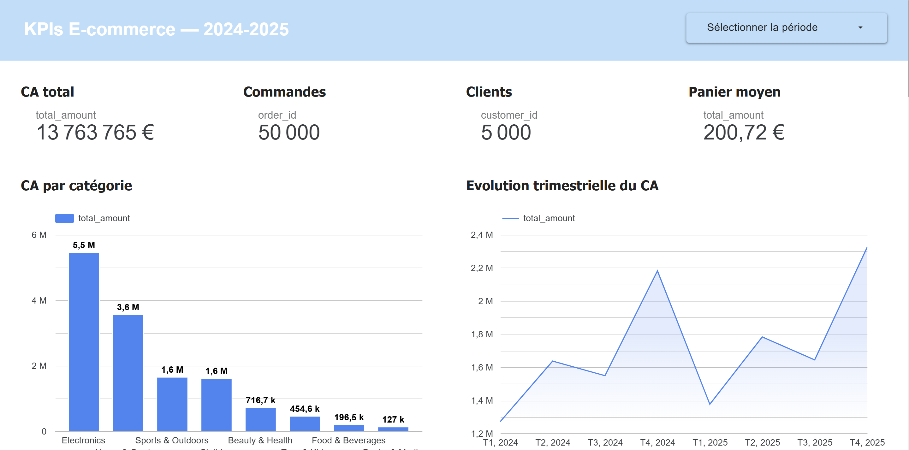

# 01 — KPIs E-commerce en SQL

## Contexte business

Un directeur commercial d'une entreprise e-commerce demande un **état des lieux complet de l'activité** sur la période 2024-2025. Il a besoin de comprendre rapidement : qui sont ses meilleurs clients, quels produits performent, comment évolue le chiffre d'affaires, et comment se répartissent les ventes par zone géographique. L'objectif est de fournir des réponses claires et chiffrées, directement exploitables pour les décisions commerciales.

## Question posée

> Quels sont les KPIs fondamentaux de notre activité e-commerce, et quelles tendances se dégagent sur 2024-2025 ?

## Stack utilisée

- **SQL** — requêtes analytiques (agrégats, GROUP BY, sous-requêtes, CASE WHEN)
- **Looker Studio** — dashboard interactif de restitution

## Dataset

`data/ecommerce_transactions.csv` — **71 371 lignes** × 15 colonnes
- 50 000 commandes, 5 000 clients, 350 produits
- Période : janvier 2024 → décembre 2025
- Variables clés : montant, quantité, remise, catégorie produit, ville, région, âge, mode de paiement

## Requêtes SQL

Le fichier `queries.sql` contient **10 requêtes commentées**, chacune répondant à une question business précise :

| # | Question | Insight principal |
|---|----------|-------------------|
| Q1 | Top 10 clients par CA | Le top 10 génère entre 74k € et 86k € chacun, tous avec 250 commandes — une base de clients fidèles à forte valeur |
| Q2 | Top 10 produits (volume) | Les produits stars sont répartis sur Electronics, Sports et Beauty — pas de dépendance à une seule catégorie |
| Q3 | Panier moyen par mois | Stable autour de **288 €** sur toute la période, avec un léger pic en février 2025 (298 €) |
| Q4 | CA par catégorie | Electronics domine à **40,5%** du CA (5,8M €), suivi de Home & Garden (26,1%) |
| Q5 | Répartition géographique | Paris concentre **24,7%** du CA (3,6M €), le top 5 des villes représente 49,6% |
| Q6 | Évolution trimestrielle | Saisonnalité nette : Q4 systématiquement le plus fort (+40% vs Q3), Q1 le plus faible |
| Q7 | Modes de paiement | Carte bancaire en tête (40,1%), suivi de PayPal (21,5%) et Apple Pay (14,7%) |
| Q8 | Remise par catégorie | Taux moyen homogène (~4,3% toutes catégories), pas de sur-discount |
| Q9 | Commandes par jour | Distribution très uniforme sur la semaine — pas de jour significativement plus fort |
| Q10 | CA par tranche d'âge | Le cœur de cible est **26-45 ans** (60,8% du CA), les 66+ ne représentent que 0,4% |

## Résultats clés

- **14,4M € de CA total** sur 2 ans, avec 50 000 commandes et un panier moyen de 289 €
- **Forte saisonnalité Q4** : le dernier trimestre représente systématiquement le pic annuel (+40%), tiré par les fêtes de fin d'année
- **Concentration géographique** : 3 régions (Île-de-France, PACA, Auvergne-Rhône-Alpes) représentent plus de 50% du CA
- **Electronics est le moteur du CA** (40,5%) avec un panier moyen de 551 € par ligne, mais Clothing domine en volume de transactions

## Dashboard Looker Studio

> 🔗 [Lien vers le dashboard](#) *(à venir)*



## Structure du dossier

```
01-sql-kpis-ecommerce/
├── README.md               ← ce fichier
├── queries.sql              ← 10 requêtes SQL commentées
└── screenshot-looker.png    ← capture du dashboard
```
